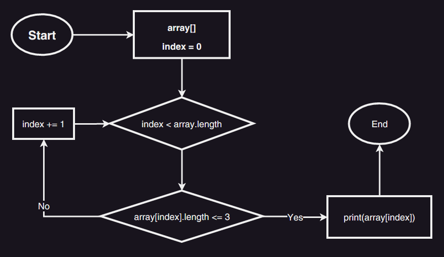

# Итоговая Контрольная. Выбор специализации

 Задача: Написать программу, которая из имеющегося массива строк формирует массив из строк, длина которых меньше либо равна 3 символа. Первоначальный массив можно ввести с клавиатуры, либо задать на старте выполнения алгоритма. При решении не рекомендуется пользоваться коллекциями, лучше обойтись исключительно массивами

## Блок-схема алгоритма



## Код программы

```C#
string[] array = { "Tom", "Sam", "Bob", "Tomas", "Samuel", "Alexander", "if", "Tokio", "in", "123", "12345", ">_<", "XD" };
Console.Write($"Задан массив: ");
PrintArray(array);
Console.WriteLine();
Console.WriteLine("Вывод массива длина строк которых меньше или ровна 3:");
PrintArray(array);
InputArray(array);


void InputArray(string[] arr)
{
    Console.Write(" => {");
    for (int i = 0; i < arr.Length; i++)
    {
        if (arr[i].Length <= 3)
        {
            Console.Write($"{arr[i]}, ");
        }

    }
    Console.Write("}");
}

void PrintArray(string[] arr)
{
    Console.Write("{");
    Console.Write(String.Join(", ", arr));
    Console.Write("}");
}
```
